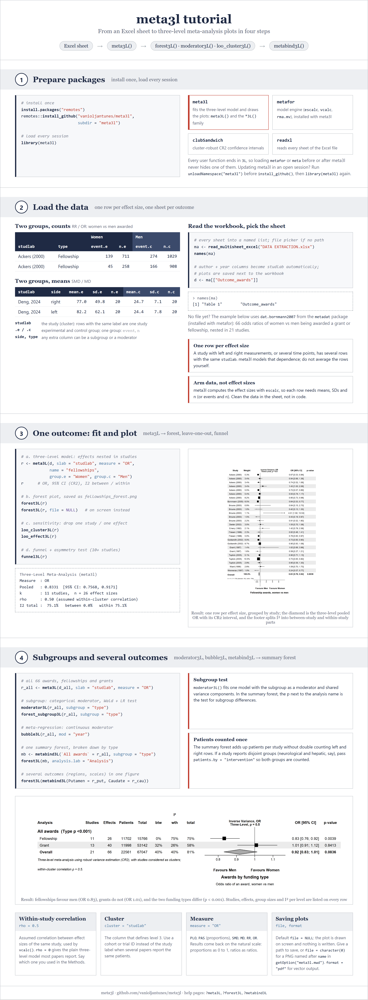
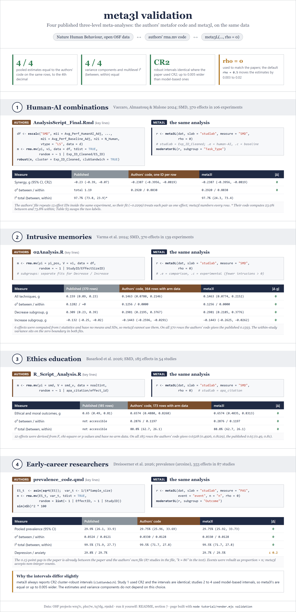

# meta3l

**Three-level meta-analysis in R, built on metafor.**

## Contents

| Section | Jump to |
|:---|:---|
| **[1 · What is this package](#1-what-is-this-package)**<br><sub>A three-level meta-analysis in one call</sub> | |
| **[2 · How to install it](#2-how-to-install-it)**<br><sub>One line from GitHub, plus a walk-through from Excel</sub> | [Tutorial](#tutorial) |
| **[3 · Data preparation](#3-data-preparation)**<br><sub>One row per effect size, one column per arm statistic</sub> | [Input formats](#input-formats) · [Clusters](#clusters-and-effect-sizes) · [Direction](#direction-of-effect) |
| **[4 · Fitting the model](#4-fitting-the-model)**<br><sub>escalc, vcalc, rma.mv, CR2 and I² in one call</sub> | [Output](#output) · [Choosing rho](#choosing-rho) |
| **[5 · Plots, subgroups and sensitivity](#5-plots-subgroups-and-sensitivity)**<br><sub>Forest, subgroup, meta-regression, leave-one-out, funnel</sub> | [Forest](#forest-plot) · [Subgroups](#subgroups) · [Meta-regression](#meta-regression) · [Leave-one-out](#leave-one-out) · [Funnel](#funnel-plot) |
| **[6 · Combining analyses](#6-combining-analyses)**<br><sub>Several outcomes on one summary forest, brain maps</sub> | [metabind3L](#one-summary-forest) · [Patient counts](#patient-counts) · [Brain map](#brain-map) |
| **[7 · Validation](#7-validation-against-published-three-level-meta-analyses)**<br><sub>Four Nature Human Behaviour meta-analyses, their code vs meta3l</sub> | [Results](#results) · [Run it yourself](#run-it-yourself) |

<sub>[References](#references) · [License](#license)</sub>

---

## 1. What is this package

`meta3l` is an opinionated R package for meta-analyses in which studies
contribute more than one effect size (left and right side, several time
points, several outcomes of the same construct). It fits the three-level
random-effects model (effect sizes nested in studies) with
[metafor](https://www.metafor-project.org/) and wraps every step in a small
set of functions, so a mentee can go from an extraction sheet to publication
figures without writing the model by hand.

**What you get:**

- **One model engine.** `meta3L()` runs `metafor::escalc()` on the raw arm
  data, builds the sampling covariance with `metafor::vcalc()`, fits
  `metafor::rma.mv(yi, V, random = ~ 1 | cluster / TE_id)` by REML, and
  reports cluster-robust (CR2) confidence intervals through `clubSandwich`.
- **Three-level heterogeneity.** Total I² split into between-study and
  within-study parts (Cheung 2014), printed with every result.
- **Six effect measures, back-transformed automatically.** Proportions (logit
  or arcsine), standardised and raw mean differences, risk and odds ratios.
- **Plots out of the box.** Forest, subgroup forest, bubble plot,
  leave-one-out by study and by effect, funnel with an asymmetry test, a
  summary forest across outcomes, and a brain map for neuroimaging outcomes.
- **Sensible defaults, few arguments.** Column names follow the `meta`
  package (`mean.e`, `sd.e`, `n.e`, ...) and are detected automatically
  when your sheet already uses them. Plots are drawn on screen and nothing is
  written to disk unless you ask for a file.

---

## 2. How to install it

Install directly from GitHub. The package lives in the `meta3l/`
subfolder of the repository:

```r
# install.packages("remotes")
remotes::install_github("vanioljantunes/meta3l", subdir = "meta3l")
```

**Required CRAN dependencies** (installed automatically):
`metafor` (>= 4.0-0), `clubSandwich` (>= 0.5.0), `readxl`, `rstudioapi`.

**Optional**, for the brain map only: `ggseg`, `ggplot2`, `sf`, `MetBrewer`.

**Every user function ends in `3L`** (`meta3L()`, `forest3L()`,
`funnel3L()`, `metabind3L()`, ...), so loading `metafor` or `meta` before or
after meta3l never hides one of them. Scripts written for meta3l 0.1.0 need
the new names:

| Before | Now |
|---|---|
| `forest(r)` | `forest3L(r)` |
| `forest_subgroup(r, ...)` | `forest_subgroup3L(r, ...)` |
| `moderator(r, ...)` | `moderator3L(r, ...)` |
| `bubble(r, ...)` | `bubble3L(r, ...)` |
| `loo_cluster(r)`, `loo_effect(r)` | `loo_cluster3L(r)`, `loo_effect3L(r)` |
| `funnel(r)` | `funnel3L(r)` |
| `metabind(...)` | `metabind3L(...)` |
| `brainmap(mb, ...)` | `brainmap3L(mb, ...)` |

### Tutorial

From an Excel extraction sheet to the figures in four steps: load the
package, read the workbook (one sheet per outcome), fit each outcome with
`meta3L()` and draw its plots, then bind the outcomes into one summary
forest. The example uses `dat.bornmann2007` from `metadat` (installed with
metafor): 66 odds ratios of women vs men being awarded, nested in 21 studies.



The page is built from `meta3l/tutorial/tutorial.html` (`Rscript tutorial/plot.R`,
then `node tutorial/render.mjs`, both from the `meta3l/` folder). The same
steps with your own workbook:

```r
library(meta3l)

# 1. Read every sheet of the workbook into a named list
#    (opens a file picker when path is NULL)
ma <- read_multisheet_excel("DATA EXTRACTION.xlsx")
names(ma)

# 2. Fit one outcome (one row per effect size, studlab = cluster)
r_putamen <- meta3L(ma[["Outcome_putamen"]], slab = "studlab",
                    measure = "MD", name = "putamen")
r_putamen

# 3. Plots for that outcome
forest3L(r_putamen)
forest_subgroup3L(r_putamen, subgroup = "side")
loo_cluster3L(r_putamen)

# 4. All outcomes on one summary forest
mb <- metabind3L(Putamen = r_putamen, Caudate = r_caudate,
               subgroup = "side")
forest3L(mb, analysis.lab = "Region")
```

`read_multisheet_excel()` builds a `studlab` column (`"author, year"`)
whenever a sheet has `author` and `year` columns, so step 2 needs no extra
work.

---

## 3. Data preparation

### Input formats

One row per effect size. The arm columns depend on the measure:

| `measure` | What it pools | Columns (meta style) |
|---|---|---|
| `"PLO"` | Proportion, logit scale | `event`, `n` |
| `"PAS"` | Proportion, arcsine scale | `event`, `n` |
| `"SMD"` | Standardised mean difference (Hedges' g) | `mean.e`, `sd.e`, `n.e`, `mean.c`, `sd.c`, `n.c` |
| `"MD"` | Raw mean difference | `mean.e`, `sd.e`, `n.e`, `mean.c`, `sd.c`, `n.c` |
| `"RR"` | Risk ratio | `event.e`, `n.e`, `event.c`, `n.c` |
| `"OR"` | Odds ratio | `event.e`, `n.e`, `event.c`, `n.c` |

For example, a mean difference sheet:

| studlab | side | mean.e | sd.e | n.e | mean.c | sd.c | n.c |
|---|---|---|---|---|---|---|---|
| Deng, 2024 | right | 77.0 | 49.8 | 20 | 24.7 | 7.1 | 20 |
| Deng, 2024 | left | 82.2 | 62.1 | 20 | 24.4 | 7.8 | 20 |
| Fan, 2025 | mean | 64.2 | 3.1 | 32 | 40.7 | 3.3 | 14 |

If your columns already have these names you can omit them from the call.
Otherwise pass them explicitly, for example `mean.e = "m_int"`. The
escalc names (`xi`, `ni`, `ai`, `bi`, `ci`, `di`, `m1i`, `sd1i`, `n1i`,
...) are also accepted.

`meta3l` computes the effect sizes itself, so it needs the arm data.
A row that only has a precomputed effect size and variance cannot be used.

### Clusters and effect sizes

- **Cluster (level 3):** the column named in `cluster`, `"studlab"` by
  default. Every row with the same value belongs to the same study.
- **Effect size (level 2):** each row. `meta3l` numbers the rows itself
  (`TE_id`), so every row is its own effect size.

### Direction of effect

For `SMD` and `MD`, a `direction` column with `"Good"` / `"Bad"` (or the
`direction` argument) flips the sign of the rows marked `"Bad"`, so that
outcomes where lower is better point the same way as the rest.

---

## 4. Fitting the model

```r
r <- meta3L(dat, slab = "studlab", measure = "SMD",
            cluster = "studlab", rho = 0.5, name = "anxiety")
print(r)      # pooled estimate, 95% CI, p, I2 total / between / within
summary(r)    # the same plus the full rma.mv output
```

### Output

`meta3L()` returns a `meta3l_result`:

```r
r$estimate    # pooled estimate, back-transformed
r$ci.lb       # lower 95% CI (CR2 robust)
r$ci.ub       # upper 95% CI (CR2 robust)
r$i2          # list: total, between, within (percent)
r$model       # the robust rma.mv object; r$model$sigma2 holds the
              # between-study and within-study variances
r$data        # the escalc data with yi, vi and TE_id
r$V           # the sampling covariance matrix from vcalc
```

Proportions (`PLO`, `PAS`) come back on the proportion scale (0.298, not
29.8%); ratios come back as ratios.

### Choosing rho

`rho` is the assumed correlation between the sampling errors of effect
sizes from the same study (left and right side of the same patients, for
example). It enters through `metafor::vcalc()`.

- `rho = 0.5` (default) is a common, conservative choice when the same
  participants give several effect sizes.
- `rho = 0` gives a diagonal sampling covariance, the standard three-level
  model most published analyses use (`rma.mv(yi, vi, random = ~ 1 | study/es)`).

Estimates move a little between the two and variance shifts from the
between-study to the within-study level (see [Validation](#results)).
State the value you used in the Methods.

---

## 5. Plots, subgroups and sensitivity

Every plot function draws on screen and writes nothing by default
(`file = NULL`). Pass `file = "name.png"` to save it, add `format = "pdf"` for
a PDF, or `file = character(0)` to get a PNG named after the analysis inside
`getOption("meta3l.mwd")`.

### Forest plot

```r
forest3L(r)
forest3L(r, ilab = c("side", "n.e", "n.c"),
       ilab.lab = c("Side", "N WD", "N HC"),
       sortvar = "yi", xlab = "Mean difference (ppb)")
```

### Subgroups

```r
mod <- moderator3L(r, subgroup = "intervention")
mod            # per-level estimates, robust Wald test, likelihood-ratio test

forest_subgroup3L(r, subgroup = "intervention")
```

`moderator3L()` fits one model with the subgroup as a categorical moderator
(shared variance components) and reports the CR2 Wald test and an ML
likelihood-ratio test against the model without it.

### Meta-regression

```r
b <- bubble3L(r, mod = "year")
b$summary      # slope, CI, robust p, R2
```

### Leave-one-out

```r
loo_cluster3L(r)   # drop one study at a time
loo_effect3L(r)    # drop one effect size at a time
```

Each returns a table of the pooled estimate and I² after every omission and
draws the influence plot.

### Funnel plot

```r
funnel3L(r)                                   # one outcome
funnel3L(list(Putamen = r_putamen,
            Caudate = r_caudate))           # several panels in one figure
```

Panels with fewer than `min.studies = 10` studies are skipped, as the
asymmetry test is not informative below that.

---

## 6. Combining analyses

### One summary forest

`metabind3L()` stacks several `meta3l_result` objects into one table and one
forest, with no new pooling across them. With `subgroup` each outcome is
broken down by that column, with the test for subgroup differences.

```r
mb <- metabind3L(
  Putamen     = r_putamen,
  Caudate     = r_caudate,
  Thalamus    = r_thalamus,
  subgroup    = "intervention",
  patients.by = "intervention"
)
mb
forest3L(mb, analysis.lab = "Region", xlab = "Mean difference (ppb)")
```

### Patient counts

The summary forest shows the number of patients per outcome without
counting the same people twice:

- By default each study contributes its largest row, so left and right
  measurements of the same patients count once.
- When a study reports disjoint groups (neurological and hepatic patients,
  say), pass `patients.by = "intervention"`. Each study then contributes its
  total row if it has one (a level matching `patients.total = "total"`),
  otherwise the largest row of every group, added up. Controls shared by the
  groups still count once.

### Brain map

For neuroimaging outcomes, `brainmap3L()` shades a FreeSurfer segmentation by
the pooled estimate of each region, one panel per subgroup level:

```r
brainmap3L(mb, panels = c("Overall", "Neuro Wilson", "Hepatic Wilson"))
```

---

## 7. Validation against published three-level meta-analyses

To anchor the numbers, `meta3l` was run on the open data of four
three-level meta-analyses published in *Nature Human Behaviour*. For each
one, three things are compared:

- **Published:** the result in the paper.
- **Authors' code:** the authors' own metafor call, re-run on their data.
- **meta3l:** `meta3L()` on the same rows with `rho = 0`, the specification
  the authors used (no sampling correlation).

The studies were chosen because they share arm-level data (means, SDs and
n, or events and n) and their analysis code, and use the standard model
`rma.mv(yi, vi, random = ~ 1 | study / effect)`. No Lancet or JAMA paper met
both conditions at the time of the search (September 2026).

| # | Study | Measure | Effects / clusters | Data |
|---|---|---|---|---|
| 1 | Vaccaro, Almaatouq & Malone 2024, human-AI combinations | SMD | 370 / 106 experiments | [osf.io/wrq7c](https://osf.io/wrq7c/) |
| 2 | Varma et al. 2024, modulating intrusive memories | SMD | 370 / 139 experiments | [osf.io/phu7w](https://osf.io/phu7w/) |
| 3 | Basarkod et al. 2026, ethics education | SMD | 185 / 54 studies | [osf.io/tq7dg](https://osf.io/tq7dg/) |
| 4 | Dreisoerner et al. 2026, mental health problems in early-career researchers | PAS | 353 / 87 studies | [osf.io/r9nkd](https://osf.io/r9nkd/) |



The validation page is built from `meta3l/tutorial/validation.html`
(`node tutorial/render.mjs validation`).

### Results

Pooled estimate [95% CI]; σ² between / within studies; I² total (between,
within).

| Study | Analysis | Published | Authors' code | meta3l |
|---|---|---|---|---|
| 1 | Synergy, g | -0.230 [-0.390, -0.070] | -0.230 [-0.388, -0.072] | -0.239 [-0.396, -0.082] |
| | σ² | | 0.290 / 0.897 | 0.292 / 0.884 |
| | I² | 97.7 (23.9, 73.8)* | 97.7 (23.9, 73.8) | 97.7 (24.3, 73.4) |
| 2 | All techniques, g | 0.159 [0.09, 0.23] | 0.146 [0.078, 0.215]† | 0.146 [0.077, 0.215] |
| | σ² | 0.128 / ~0 | 0.126 / 0.000† | 0.126 / 0.000 |
| | Decrease subgroup, g | 0.309 [0.23, 0.39] | 0.298 [0.219, 0.377]† | 0.298 [0.218, 0.378] |
| | Increase subgroup, g | -0.132 [-0.25, -0.02] | -0.144 [-0.260, -0.029]† | -0.144 [-0.262, -0.026] |
| 3 | Ethical and moral outcomes, g | 0.65 [0.49, 0.81] | 0.657 [0.488, 0.827]† | 0.657 [0.484, 0.831] |
| | σ² | | 0.288 / 0.120† | 0.288 / 0.120 |
| | I² | | 88.8 (62.7, 26.1)† | 88.8 (62.7, 26.1) |
| 4 | Pooled prevalence | 29.9% [26.1, 33.9] | 29.8% [26.0, 33.7] | 29.8% [25.9, 33.7] |
| | σ² | 0.032 / 0.012 | 0.033 / 0.013 | 0.033 / 0.013 |
| | I² | 99.5 (71.9, 27.7) | 99.5 (71.7, 27.8) | 99.5 (71.7, 27.8) |
| | Depression (moderator) | 29.8% [26.1, 33.8] | | 29.7% [26.0, 33.6] |
| | Anxiety (moderator) | 29.7% [25.7, 33.8] | | 29.5% [25.7, 33.6] |

† Authors' code restricted to the rows with arm data, which is what
`meta3l` can use. On the full data the authors' code reproduces the
published values exactly: study 2 gives 0.159 [0.091, 0.227], study 3 gives
0.653 [0.493, 0.813].

**Where the numbers match.** On the same rows and the same specification,
`meta3l` gives the same pooled estimates, variance components and
multilevel I² as metafor, in all four studies.

**Why the remaining differences exist.**

- **Confidence intervals.** `meta3l` always reports CR2 cluster-robust
  intervals. Study 1 used CR2 as well and the intervals agree. Studies 2, 3
  and 4 used model-based intervals, so `meta3l`'s are equal or slightly wider.
- **Study 1, -0.239 vs -0.230.** 13 effect IDs in the authors' file are
  duplicated inside the same experiment, so their model treats each pair as
  one effect. `meta3l` gives every row its own ID. The authors' model with
  one ID per row gives exactly -0.2387.
- **\* Study 1, I² labels.** The authors' code computes 23.9% between
  experiments and 73.8% within; Supplementary Table S5 prints the two labels
  the other way round. `meta3l` agrees with the code.
- **Studies 2 and 3, rows without arm data.** 6 and 12 effect sizes were
  derived from t, F, chi-square or p values and have no means and SDs.
  `meta3l` cannot use them, hence the † comparison.
- **Study 4, 29.8% vs 29.9%.** The gap is already between the paper and the
  authors' own data file (87 studies in the file, "k = 86" in the paper).
  Events are not stored; they were rebuilt as proportion × n, which gives
  non-integer counts. `meta3l` accepts them, and rounding them changes
  nothing.
- **Moderators.** Study 1's moderator model used a CR1 correction and
  `meta3l` uses CR2, so its intervals are wider for the small Create group
  (34 effects): 0.193 [-0.302, 0.688] against 0.19 [-0.09, 0.48].

**The default `rho = 0.5`.** With the package default instead of `rho = 0`,
the pooled estimates move by 0.003 to 0.02 (study 1: -0.233, study 2: 0.143,
study 3: 0.635, study 4: 29.6%) and part of the between-study variance moves
to the within-study level. None of the four papers assumed a sampling
correlation.

### Run it yourself

Download the data files from the OSF projects above, then run the calls
below. Each block reproduces the meta3l column of the table. The comparison
with the authors' own code uses their scripts from the same OSF projects.

<details>
<summary><b>Study 1</b>: human-AI combinations (<code>Data_Extraction.csv</code>)</summary>

```r
library(meta3l)
d <- read.csv("Data_Extraction.csv")

dat <- data.frame(
  studlab = factor(d$Exp_ID_Cleaned),
  mean.e = d$Avg_Perf_HumanAI_Adj, sd.e = d$Sd_Perf_HumanAI, n.e = d$N_HumanAI,
  mean.c = d$Avg_Perf_Baseline_Adj, sd.c = d$Sd_Perf_Baseline,
  n.c = d$N_Human,               # the authors use N_Human for every baseline
  Task_Type = d$Task_Type
)
r <- meta3L(dat, slab = "studlab", measure = "SMD", rho = 0)
r                                  # g = -0.239 [-0.396, -0.082]
moderator3L(r, subgroup = "Task_Type")
```

</details>

<details>
<summary><b>Study 2</b>: intrusive memories (<code>IntrusionMetaData_Clean_v2.csv</code>)</summary>

```r
library(meta3l)
d <- read.csv("IntrusionMetaData_Clean_v2.csv")
d <- d[!grepl("No direction", d$Notes_fromSZ) &
       d$DependentVariablesType == "Intrusion frequency" & !is.na(d$yi_pos), ]

# The analysed effect is Comparison minus Experimental (fewer intrusions = positive)
dat <- with(d, data.frame(
  studlab = StudyID,
  mean.e = Comparison_Mean,   sd.e = Comparison_SD,   n.e = ComparisonConditionSampleSize,
  mean.c = Experimental_Mean, sd.c = Experimental_SD, n.c = ExperimentalConditionSampleSize,
  dir = Intrusion_Predicted_Direction))
dat <- dat[complete.cases(dat[, 2:7]), ]     # 364 of 370 rows have arm data

meta3L(dat, slab = "studlab", measure = "SMD", rho = 0)                          # 0.146
meta3L(dat[dat$dir == "Decrease", ], slab = "studlab", measure = "SMD", rho = 0)  # 0.298
meta3L(dat[dat$dir == "Increase", ], slab = "studlab", measure = "SMD", rho = 0)  # -0.144
```

</details>

<details>
<summary><b>Study 3</b>: ethics education (<code>CleanData.xlsx</code>)</summary>

```r
library(meta3l)
d <- as.data.frame(readxl::read_excel("CleanData.xlsx"))
num <- function(x) suppressWarnings(as.numeric(x))
d$smd <- num(d$smd)
d <- d[!is.na(d$smd) & d$smd < 80 & d$smd < 3 &
       d$type_comp %in% c("Control", "Inactive Control",
                          "Waitlist Control", "Active Control"), ]

dat <- with(d, data.frame(
  studlab = apa_citation,
  mean.e = num(int_mean_t2),  sd.e = num(int_sd_t2),  n.e = num(int_n),
  mean.c = num(comp_mean_t2), sd.c = num(comp_sd_t2), n.c = num(comp_n)))
dat <- dat[complete.cases(dat), ]            # 173 of 185 rows have arm data

meta3L(dat, slab = "studlab", measure = "SMD", rho = 0)   # 0.657 [0.484, 0.831]
```

</details>

<details>
<summary><b>Study 4</b>: early-career researchers (<code>long format file.xlsx</code>)</summary>

```r
library(meta3l)
d <- as.data.frame(readxl::read_excel("long format file.xlsx"))[-(1:25), ]
num <- function(x) suppressWarnings(as.numeric(x))
d <- d[num(d$Effect_Size) %in% 1 & !is.na(d$Author), ]

dat <- data.frame(
  studlab = d$StudyID,
  event   = num(d$ES) * num(d$Sample_size),   # events rebuilt from the proportion
  n       = num(d$Sample_size),
  Outcome = as.character(d$Outcome)           # 2 = depression, 3 = anxiety
)
r <- meta3L(dat, slab = "studlab", measure = "PAS", rho = 0)
r                                  # 0.298 [0.259, 0.337]
moderator3L(r, subgroup = "Outcome")
```

</details>

---

## References

- Cheung MW-L. *Modeling dependent effect sizes with three-level
  meta-analyses: a structural equation modeling approach.* Psychol Methods.
  2014;19(2):211-229.
- Viechtbauer W. *Conducting meta-analyses in R with the metafor package.*
  J Stat Softw. 2010;36(3):1-48.
- Pustejovsky JE, Tipton E. *Small-sample methods for cluster-robust variance
  estimation and hypothesis testing in fixed effects models.* J Bus Econ Stat.
  2018;36(4):672-683.
- Vaccaro M, Almaatouq A, Malone T. *When combinations of humans and AI are
  useful: a systematic review and meta-analysis.* Nat Hum Behav.
  2024;8:2293-2303. doi:10.1038/s41562-024-02024-1
- Varma MM, Zeng S, Singh L, et al. *A systematic review and meta-analysis of
  experimental methods for modulating intrusive memories following
  lab-analogue trauma exposure in non-clinical populations.* Nat Hum Behav.
  2024;8:1968-1987. doi:10.1038/s41562-024-01956-y
- Basarkod G, Cahill LS, Burston A, et al. *Educational interventions are
  effective in improving students' ethical and moral outcomes: a systematic
  review and meta-analysis.* Nat Hum Behav. 2026.
  doi:10.1038/s41562-026-02456-x
- Dreisoerner A, Goetz V, Frohnmayer D, Tran US, Voracek M, Nater UM.
  *Prevalence and severity of mental health problems in early-career
  researchers: a systematic review and meta-analysis.* Nat Hum Behav. 2026.
  doi:10.1038/s41562-026-02505-5

## License

MIT.
